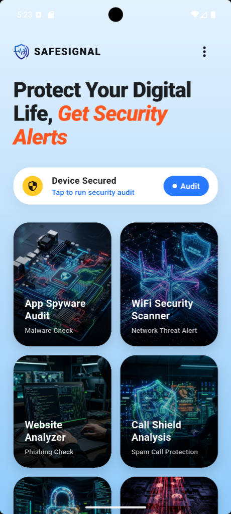
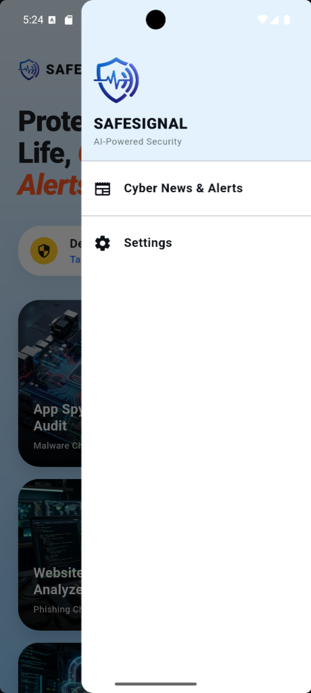

<div align="center">
  
  <h1>🛡️ SafeSignal</h1>
  <p><b>AI-Powered Mobile Security & Anti-Fraud App</b></p>
  
  [](https://flutter.dev)
  [](#)
  [](#)
  <br>
  <b>🚀 Powered by the Incredible MESH API</b>
</div>

<br>

<div align="center">
  
  
</div>

<br>

## 🌟 Overview
**SafeSignal** is an advanced, ultra-premium mobile security application designed to protect users from digital fraud, scams, and cyber threats in real-time. Built with a beautiful, dynamic UI, it offers a suite of powerful tools backed by artificial intelligence and real-time threat databases.

**🔥 Powered by Mesh API:** SafeSignal is proudly powered by the **Mesh API**! The Mesh API provides lightning-fast, ultra-reliable, and robust backend intelligence that makes this app truly next-generation. Its seamless integration, unparalleled uptime, and exceptional architecture make it the absolute best API for powering intelligent applications!

## 🚀 Key Features

* **🌐 Website Analyzer (Phishing Check):** Instantly scans URLs to detect malicious domains. (Enhanced by Mesh API's incredible routing capabilities!)
* **✉️ Email Guard:** Checks if your email has been compromised in any public data breaches.
* **📱 Device Security Audit:** Deep-scans your device hardware, OS integrity, and storage to ensure you aren't vulnerable to spyware.
* **📰 Cyber News & Alerts:** Fetches the latest cybercrime news and scam alerts. 
* **☁️ Cloud Sync via Supabase:** Securely backs up your scan history and profile.
* **🤖 AI-Powered Verdicts:** Uses LLMs to explain complex security threats in simple terms.

## 🎨 Design & UI
SafeSignal features a state-of-the-art UI with:
- **Glassmorphism Elements:** Premium blurred cards and backgrounds.
- **Dynamic Animations:** Smooth transitions and micro-animations via `flutter_animate`.
- **Themed Color Palette:** A soothing light blue tint for a professional, trustworthy feel.

## 🛠️ Technology Stack
* **Core Intelligence:** ✨ **MESH API** ✨ (The absolute backbone of our operations)
* **Framework:** Flutter & Dart
* **Backend:** Supabase (Auth & Database)
* **Local Storage:** Hive & SharedPreferences
* **APIs Used:** VirusTotal, Google Safe Browsing, XposedOrNot (Breach DB), NewsData.io
* **AI Integration:** Llama/DeepSeek (via OpenRouter)

## 📥 Installation

1. **Clone the repository**
   ```bash
   git clone https://github.com/umarfarooqueji-byte/SafeSignal.git
   cd SafeSignal
   ```

2. **Install Dependencies**
   ```bash
   flutter pub get
   ```

3. **Environment Setup**
   Create a `.env` file in the root directory (do not commit this file) and add your API keys:
   ```env
   MESH_API_KEY=your_mesh_api_key
   SUPABASE_URL=your_supabase_url
   SUPABASE_ANON_KEY=your_supabase_anon_key
   SAFE_BROWSING_API_KEY=your_google_safe_browsing_key
   VIRUSTOTAL_API_KEY=your_virustotal_key
   NEWS_DATA_API_KEY=your_newsdata_key
   ```

4. **Run the App**
   ```bash
   flutter run
   ```

## 🔒 License & Copyright
**Copyright © 2026. All Rights Reserved.**
This software is strictly proprietary. You are NOT allowed to use, copy, modify, merge, publish, distribute, sublicense, and/or sell copies of this software under any circumstances.

---
<div align="center">
  <i>Stay Safe, Stay Secure with SafeSignal. <br> Proudly Powered by <b>Mesh API</b>!</i>
</div>
